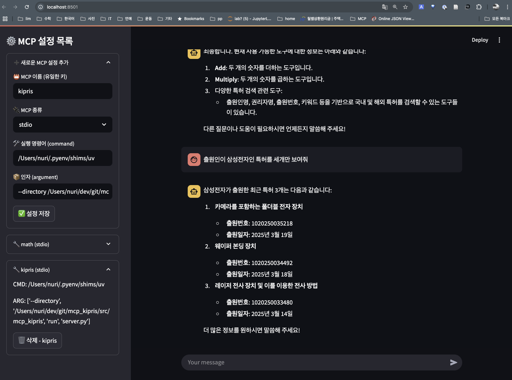
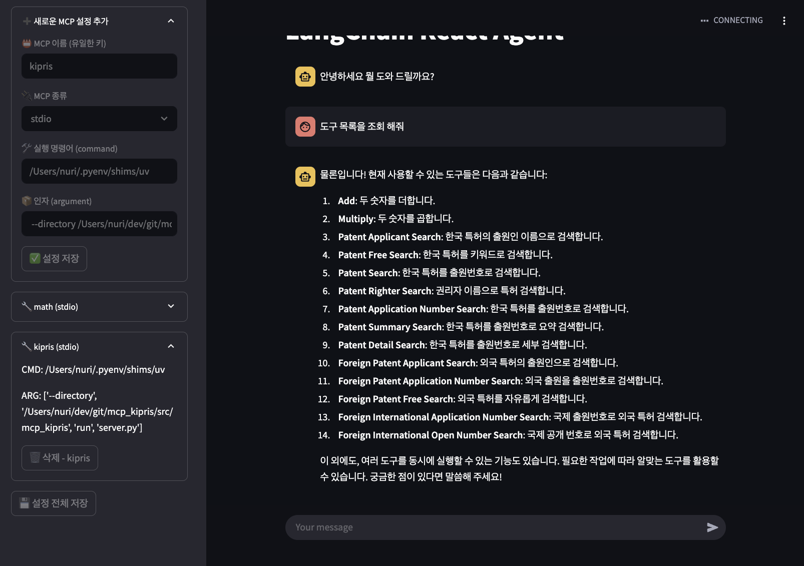

# Streamlit MCP Client

MCP 서버와 통신하는 Streamlit 기반의 React Agent 클라이언트 애플리케이션입니다.

## 프로젝트 개요

이 프로젝트는 Streamlit을 활용하여 MCP(Message Communication Protocol) 서버와 통신하는 간단한 React Agent를 구현한 것입니다. Streamlit의 직관적인 UI 컴포넌트를 활용하여 서버와의 통신을 시각적으로 표현합니다.

React Agent 구현은 [OpenMCP](https://github.com/sharandac/OpenMCP) 프로젝트의 코드 일부를 인용하였습니다. LangChain과 LangGraph를 기반으로 작성되었습니다. 이를 통해 효율적인 대화형 에이전트 시스템을 구축했습니다.

## 스크린샷

### 메인 화면


기본 화면 구조

### 상세 기능


사용중인 도구 조회 화면

## 기술 스택

- Python
- Streamlit
- LangChain
- LangGraph
- MCP Protocol

## 설치 방법

1. 가상환경 생성 및 활성화

```bash
python -m venv .venv
source .venv/bin/activate  # Linux/Mac
# or
.venv\Scripts\activate  # Windows
```

2. 필요한 패키지 설치

```bash
pip install -r requirements.txt
```

## 실행 방법

```bash
streamlit run main.py
```

## 프로젝트 구조

```
streamlit_mcp_client/
├── main.py                # 메인 Streamlit 애플리케이션
├── src/                   # 소스 코드
│   └── api/              # API 관련 모듈
│       ├── graph.py      # LangGraph 기반 React Agent 구현
│       └── math_server.py # 수학 서버 통신
├── config/               # 설정 파일 디렉토리
│   └── mcp_config.json   # MCP 서버 연결 및 프로토콜 설정
├── assets/               # 이미지 등 정적 파일
│   ├── demo1.png         # 메인 화면 스크린샷
│   └── demo2.png         # 상세 기능 스크린샷
├── .streamlit/           # Streamlit 설정
│   └── secrets.toml      # 시크릿 설정
├── pyproject.toml        # 프로젝트 설정
├── .env                  # 환경 변수
└── README.md            # 프로젝트 문서
```

## 설정

### MCP 설정

MCP 서버 연결 및 프로토콜 관련 설정은 `config/mcp_config.json` 파일에서 관리됩니다. 이 파일에서 서버 주소, 포트, 통신 프로토콜 등의 설정을 변경할 수 있습니다.

## 향후 작업 계획

현재 개발 중인 기능들과 향후 구현 예정인 작업들입니다:

1. **서버 통신 테스트**

   - SSE(Server-Sent Events) 기반 실시간 통신 테스트
   - Node.js 기반 서버와의 통신 테스트
2. **코드 최적화**

   - 전반적인 코드 구조 개선
   - 성능 최적화
   - 테스트 코드 작성
3. **구조 변경**

   - 프로젝트 구조 리팩토링
   - 모듈 구조 개선

## 참고 링크

- [OpenMCP](https://github.com/sharandac/OpenMCP) - MCP 프로토콜 참조
- [LangChain](https://python.langchain.com/) - LLM 애플리케이션 프레임워크
- [LangGraph](https://python.langchain.com/docs/langgraph) - LangChain 기반 그래프 오케스트레이션
- [mcp kipris](https://github.com/nuri428/mcp_kipris) - 제가 만든  plus.kipris.or.kr API MCP Server

## 라이선스

MIT License

## 기여 방법

1. 이 저장소를 Fork 합니다.
2. 새로운 Feature 브랜치를 생성합니다.
3. 변경사항을 Commit 합니다.
4. 브랜치에 Push 합니다.
5. Pull Request를 생성합니다.
